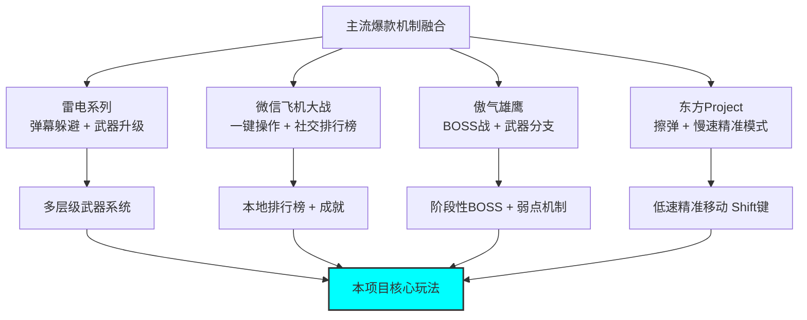
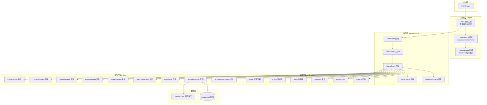
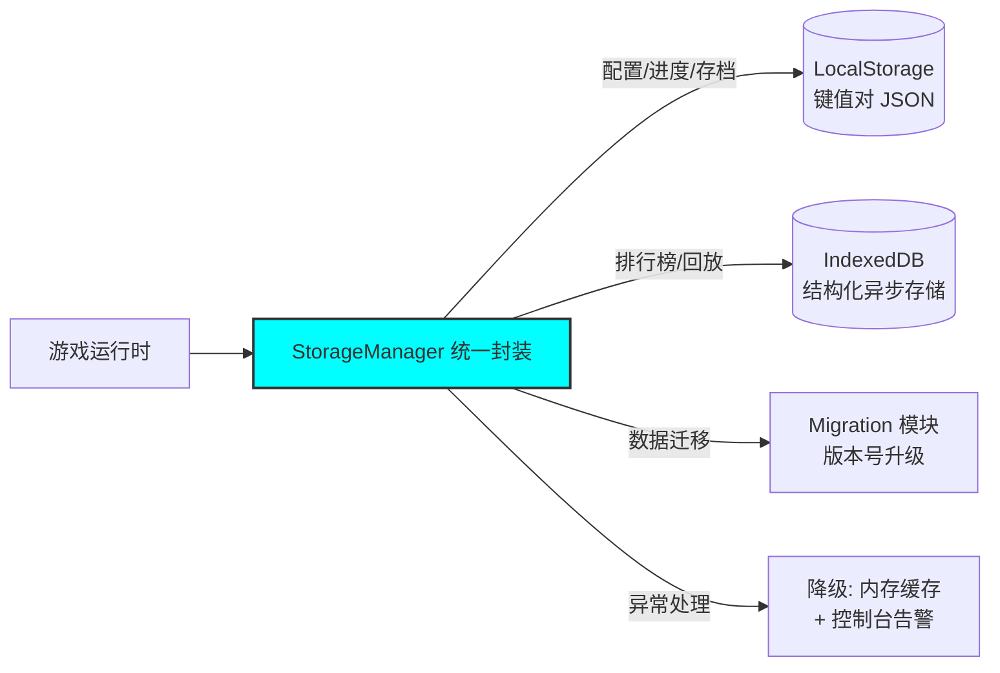
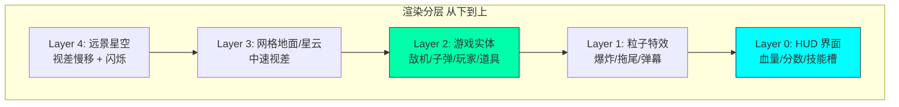
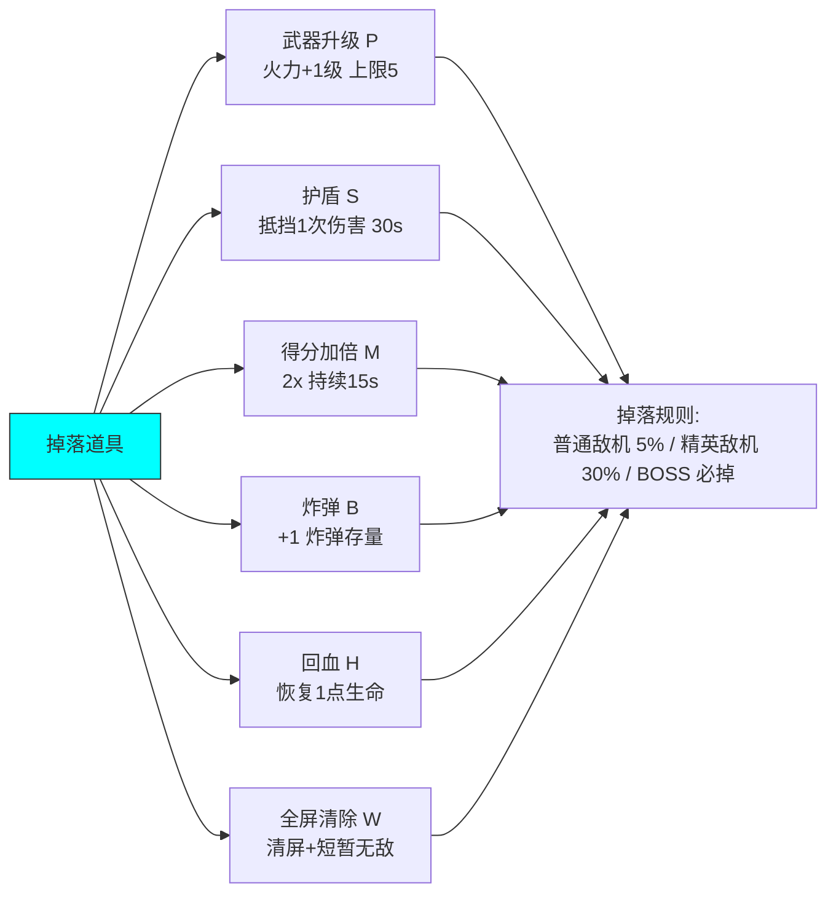
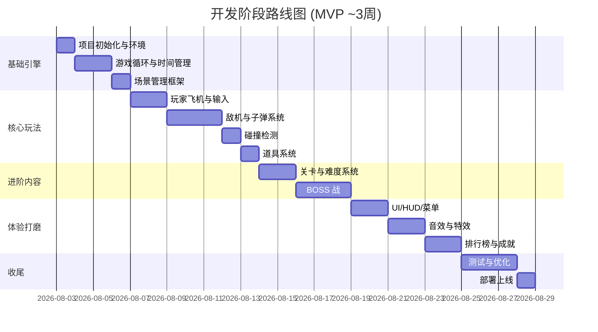
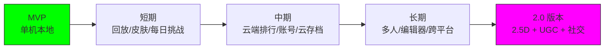

# 飞机大战网页小游戏 - 技术设计文档

> **文档版本**：v1.0  
> **目标读者**：单人开发者（Solo Builder）  
> **文档定位**：后续代码生成的核心蓝图  
> **最后更新**：2026-08-02

---

## 📖 目录

1. [项目概述](#1-项目概述)
2. [技术架构](#2-技术架构)
3. [功能需求详述](#3-功能需求详述)
4. [开发指南](#4-开发指南)
5. [测试要求](#5-测试要求)
6. [扩展建议](#6-扩展建议)
7. [附录](#7-附录)

---

## 1. 项目概述

### 1.1 项目定位

本项目是一款**科技风格（Sci-Fi / Cyberpunk）的飞机大战网页小游戏**，运行于现代浏览器，无需安装、即开即玩。游戏融合市面上主流爆款飞机大战（如《雷电》《傲气雄鹰》《东方Project》《微信飞机大战》）的核心玩法机制，面向碎片化娱乐场景，单局时长 3–10 分钟。

### 1.2 核心设计目标

| 维度 | 目标 | 说明 |
|------|------|------|
| **玩法** | 经典 + 创新 | 保留纵向卷轴射击核心，加入科技风道具与 BOSS 战 |
| **视觉** | 科技感强烈 | 霓虹光效、粒子拖尾、网格背景、HUD 全息感 |
| **性能** | 流畅 60FPS | 在主流设备上稳定 60 帧，低端设备不低于 30 帧 |
| **体量** | 单人可完成 | 代码总量控制在 ~5000 行以内，2–4 周可交付 MVP |
| **可扩展** | 模块化架构 | 后续可快速接入新关卡、新敌机、新道具 |

### 1.3 玩法机制融合图



### 1.4 平台与受众

- **平台**：现代浏览器（Chrome / Edge / Firefox / Safari），同时适配桌面端键鼠与移动端触控
- **受众**：休闲玩家、怀旧射击游戏爱好者
- **分发**：可直接部署至 GitHub Pages / Vercel / Netlify 等静态托管

---

## 2. 技术架构

### 2.1 前端技术栈选择

#### 2.1.1 方案对比

| 方案 | 优点 | 缺点 | 单人开发者适用度 |
|------|------|------|------------------|
| **HTML5 Canvas + TypeScript（原生）** ✅ 推荐 | 轻量、可控性强、无框架依赖、性能优化空间大、包体积小 | 需自行实现游戏循环、场景管理等基础能力 | ★★★★★ |
| **Phaser.js** | 功能完整（场景/物理/动画/音频一站式）、社区生态丰富 | 包体积大（~1MB）、黑盒较重、定制科技风特效需绕开框架 | ★★★☆☆ |
| **Three.js** | 3D 表现力强、 WebGL 渲染高性能 | 2D 飞机大战用 3D 引擎属于过度设计、学习曲线陡 | ★★☆☆☆ |
| **PixiJS** | 2D 渲染性能极佳、WebGL 优先 | 仅渲染层，需自行搭建游戏框架 | ★★★★☆ |

#### 2.1.2 最终选型：**HTML5 Canvas 2D + TypeScript**

**选择理由**：
1. **轻量零依赖**：单人开发者无需处理框架版本升级、依赖冲突
2. **科技风格特效自由度高**：粒子、光晕、网格、扫描线等均可手写实现，效果可控
3. **性能可控**：可针对渲染管线做精细化优化（对象池、离屏 Canvas、脏矩形等）
4. **学习与维护成本平衡**：TypeScript 提供类型安全，Canvas API 简单直观

#### 2.1.3 完整技术栈

```
┌─────────────────────────────────────────────────┐
│  渲染层: HTML5 Canvas 2D API                    │
│  语言:   TypeScript 5.x (严格模式)              │
│  构建:   Vite 5.x (极速 HMR + 生产打包)         │
│  代码规范: ESLint + Prettier                    │
│  版本管理: Git                                  │
│  测试:   Vitest (单元) + 手动 (功能/性能)        │
│  部署:   Vercel / GitHub Pages (静态托管)        │
└─────────────────────────────────────────────────┘
```

### 2.2 游戏核心模块划分

#### 2.2.1 系统架构总览



#### 2.2.2 模块职责清单

| 层级 | 模块 | 职责 | 关键接口（伪） |
|------|------|------|----------------|
| 引擎 | `Game` | 全局状态、场景调度 | `start()` `pause()` `changeScene()` |
| 引擎 | `GameLoop` | 固定逻辑步长 + 可变渲染 | `tick(timestamp)` |
| 引擎 | `TimeManager` | deltaTime、帧率统计、慢动作 | `getDelta()` `getFPS()` |
| 场景 | `SceneManager` | 场景栈、切换、过渡动画 | `push()` `pop()` `switch()` |
| 场景 | `GameScene` | 战斗主逻辑、实体编排 | `update(dt)` `render(ctx)` |
| 实体 | `Entity`(基类) | 位置、速度、生命、绘制 | `update(dt)` `render(ctx)` `getBounds()` |
| 实体 | `Player` | 移动、射击、武器、护盾 | `move()` `shoot()` `takeDamage()` |
| 实体 | `Enemy` 子类 | 多种敌机 AI | `aiUpdate(dt)` |
| 实体 | `Bullet` 子类 | 玩家/敌机子弹、弹道 | `onHit(target)` |
| 实体 | `Boss` | 多阶段、弹幕模式 | `nextPhase()` `firePattern()` |
| 实体 | `PowerUp` 子类 | 武器/护盾/加倍/炸弹 | `apply(player)` |
| 实体 | `Particle` | 爆炸、拖尾、特效 | `update(dt)` |
| 服务 | `InputManager` | 键鼠/触摸统一抽象 | `isDown(key)` `getPointer()` |
| 服务 | `CollisionSystem` | 空间分区 + AABB/圆形检测 | `check(groups)` |
| 服务 | `AudioManager` | 音效播放、BGM、静音 | `playSfx()` `playBgm()` |
| 服务 | `AssetManager` | 图片/音频加载、缓存 | `load(manifest)` `get(key)` |
| 服务 | `SpawnSystem` | 按时间/分数生成敌机波次 | `update(dt)` |
| 服务 | `DifficultyManager` | 难度曲线、参数动态调整 | `getLevel()` `scaleParams()` |
| 服务 | `UIManager` | HUD、菜单、弹窗绘制 | `drawHUD()` `showToast()` |
| 服务 | `StorageManager` | 本地持久化抽象 | `save()` `load()` `getRank()` |
| 服务 | `AchievementSystem` | 成就检测与解锁 | `track(event)` `unlock(id)` |

### 2.3 数据存储方案

#### 2.3.1 存储介质选型

| 数据类型 | 存储介质 | 理由 |
|----------|----------|------|
| 用户配置（音效开关、画质、键位） | **LocalStorage** | 数据量小（<1KB）、同步读取简单 |
| 游戏进度（最高关卡、累计击杀、成就） | **LocalStorage** | 结构化小数据、需快速加载 |
| 当局存档（断线续玩） | **LocalStorage** | 单对象 JSON、低频写入 |
| 排行榜（Top 50 历史成绩） | **IndexedDB** | 记录数较多、需索引查询、异步不阻塞 |
| 战斗回放（可选高级特性） | **IndexedDB** | 数据量大、按需加载 |

#### 2.3.2 数据结构设计

```typescript
// LocalStorage 键命名空间: "pwa_{key}"
interface UserConfig {
  version: string;          // 配置版本，用于迁移
  soundEnabled: boolean;
  musicEnabled: boolean;
  musicVolume: number;      // 0-1
  sfxVolume: number;        // 0-1
  quality: 'low' | 'medium' | 'high';
  controlScheme: 'keyboard' | 'mouse' | 'touch';
  keyBindings: Record<string, string>;
}

interface GameProgress {
  version: string;
  highestLevel: number;     // 已解锁最高关卡
  totalKills: number;       // 累计击杀
  totalPlayTime: number;    // 累计游戏时长(秒)
  totalCoins: number;       // 累计金币(若有商店)
  unlockedAchievements: string[]; // 成就ID列表
  lastSavedAt: number;      // 时间戳
}

interface SaveSlot {
  slotId: number;
  level: number;            // 当前关卡
  score: number;
  weaponLevel: number;
  playerHp: number;
  timestamp: number;
}

// IndexedDB 库: "PlaneWarDB" v1
//   store: "scores"        排行榜记录
//   store: "replays"       战斗回放(可选)
interface ScoreRecord {
  id?: number;              // 自增主键
  score: number;
  level: number;
  kills: number;
  player: string;           // 玩家昵称
  createdAt: number;        // 时间戳(用于排序索引)
  rank?: number;            // 排名(查询时计算)
}
```

#### 2.3.3 存储架构图



> **设计要点**：所有存储访问统一通过 `StorageManager`，屏蔽底层差异；写入采用「防抖 + try/catch」避免高频写盘与配额溢出崩溃；当浏览器禁用存储时降级为内存缓存并提示用户。

---

## 3. 功能需求详述

### 3.1 视觉设计

#### 3.1.1 视觉风格定调

**科技 / 赛博朋克 / 全息 HUD 风格**：以深蓝-黑为主色，霓虹青/品红/黄为强调色，整体冷色调营造太空科技感。

| 视觉元素 | 设计规范 |
|----------|----------|
| 主色板 | 背景 `#05070F`、主色 `#00F0FF`(青)、强调 `#FF2E88`(品红)、警告 `#FFE600`(黄)、文字 `#E6F7FF` |
| 字体 | 标题 `Orbitron`（科技感）、正文 `Rajdhani`、数字 `Share Tech Mono` |
| 线条 | 1–2px 发光线、扫描线、网格背景（透视消失点） |
| 光效 | 辉光（`shadowBlur`）、粒子拖尾、爆炸辐射、屏幕震动 |
| 动效 | 60FPS 流畅、UI 出入场缓动（`easeOutCubic`）、打击反馈（顿帧 50ms） |

#### 3.1.2 分层视觉体验



每层使用独立离屏 Canvas 渲染，按需重绘，降低主 Canvas 绘制压力。

#### 3.1.3 科技风 UI 元素清单

- **HUD**：左上血量条（分段能量条 + 数字）、右上分数（等宽数字滚动）、底部技能槽（护盾/炸弹冷却环）
- **全息对话框**：半透明青色边框 + 扫描线纹理 + 顶角直角装饰
- **按钮**：六边形/切角矩形 + 悬停辉光扩散 + 点击粒子迸发
- **伤害数字**：浮动数字（暴击放大、暴击品红色）
- **屏幕特效**：受击红色 vignette、低血量心跳脉冲边框、BOSS 出场全屏扫描线

### 3.2 基础玩法

#### 3.2.1 玩家飞机控制

| 控制方式 | 操作 | 行为 |
|----------|------|------|
| 键盘 | ↑↓←→ / WASD | 八方向移动 |
| 键盘 | Shift | 低速精准模式（移速降 40%，显示判定点） |
| 键盘 | 空格 / Z | 射击（按住连发） |
| 键盘 | X | 释放炸弹（清屏 + 短暂无敌） |
| 键盘 | C | 切换武器形态（若已解锁） |
| 键盘 | Esc / P | 暂停 |
| 鼠标 | 移动 | 飞机跟随光标 |
| 鼠标 | 左键 | 射击 |
| 触摸 | 拖动 | 飞机跟随手指（偏移显示避免遮挡） |
| 触摸 | 双指点击 | 释放炸弹 |

**移动参数**：常速 360 px/s，低速 144 px/s；边界自动夹紧；移动加入加速度与摩擦（0.15s 达到最大速）以提升手感。

#### 3.2.2 敌机类型设计

| 敌机ID | 名称 | 血量 | 移动模式 | 攻击 | 得分 | 出现关卡 |
|--------|------|------|----------|------|------|----------|
| E1 | 侦察机 | 1 | 直线下落 | 无 | 100 | 全关卡 |
| E2 | 截击机 | 3 | 正弦摆动 | 单发直射 | 200 | 关卡1+ |
| E3 | 重装机 | 8 | 缓慢下落+横移 | 三连散射 | 500 | 关卡2+ |
| E4 | 自爆机 | 2 | 追踪玩家 | 撞击爆炸 | 300 | 关卡3+ |
| E5 | 护盾机 | 6 | 编队行进 | 间歇齐射（带护盾） | 600 | 关卡4+ |
| E6 | 隐形机 | 4 | 间歇隐身 | 突袭单发 | 800 | 关卡5+ |

#### 3.2.3 道具系统



**道具表现**：旋转浮动的六边形图标 + 颜色编码（P红/S蓝/M金/B紫/H绿/W白），接近时磁吸效果（半径 80px 内向玩家加速）。

#### 3.2.4 武器系统

| 武器等级 | 弹道形态 | 伤害 | 射速 |
|----------|----------|------|------|
| Lv1 | 单发直射 | 1 | 6/s |
| Lv2 | 双发并行 | 1×2 | 6/s |
| Lv3 | 三发扇形 | 1×3 | 7/s |
| Lv4 | 三发+侧翼追踪 | 1×3+0.5×2 | 7/s |
| Lv5 | 五发扇形+追踪 | 1×5+0.5×2 | 8/s |

> 受击降级：被击中时武器等级 -1（最低 Lv1），鼓励玩家躲避。

### 3.3 进阶玩法

#### 3.3.1 关卡系统

共 **6 个关卡 + 1 个无尽模式**，每关包含 3 个波次阶段 + 1 场 BOSS 战。


#### 3.3.2 难度递增机制

`DifficultyManager` 维护全局难度系数 `D(t)`，随时间与分数动态增长：

```
D(t) = 1 + 0.15 * (currentLevel - 1) + 0.02 * minutesPlayed + 0.0001 * score
```

影响参数（均随 D 线性/指数缩放）：

| 参数 | 缩放公式 | 说明 |
|------|----------|------|
| 敌机生成间隔 | `baseInterval / D` | 越来越密 |
| 敌机移动速度 | `baseSpeed * (0.8 + 0.2*D)` | 越来越快 |
| 敌机射击频率 | `baseFireRate * D` | 越来越勤 |
| 敌机血量 | `floor(baseHp * (1 + 0.1*D))` | 越来越厚 |
| 道具掉率 | `max(0.5, 1 - 0.05*D)` | 略降保持挑战 |

#### 3.3.3 BOSS 战设计

**通用 BOSS 框架**：多血量条、多阶段、多弹幕模式、弱点机制。

| 阶段 | 血量区间 | 行为 |
|------|----------|------|
| Phase 1 | 100%–66% | 螺旋弹幕 + 周期性冲撞 |
| Phase 2 | 66%–33% | 增加追踪弹 + 召唤小怪 |
| Phase 3 | 33%–0% | 狂暴：弹幕密度 ×2 + 屏幕扫射 + 暴露弱点（双倍伤害） |

**6 个 BOSS 主题**（每关 1 个）：

| 关卡 | BOSS 名 | 特色机制 |
|------|---------|----------|
| 1 | 「铁壁」要塞 | 旋转护盾环，需击破护盾缺口 |
| 2 | 「散射」蜂巢 | 分裂弹幕，需走位间隙 |
| 3 | 「追踪」猎手 | 锁定追踪弹，需绕柱躲避 |
| 4 | 「编队」指挥 | 召唤护盾机编队 |
| 5 | 「幻影」幽灵 | 间歇隐身 + 突袭 |
| 6 | 「终焉」核心 | 三阶段全机制融合 + 弱点暴击 |

**BOSS 出场仪式感**：全屏警告 → 扫描线 → BOSS 从顶部缓降 → 名字横幅 → 战斗开始。

### 3.4 特色系统

#### 3.4.1 积分排行榜

- **本地排行榜**：IndexedDB 存储 Top 50，按分数降序，含玩家昵称、关卡、击杀数、日期
- **结算页**：游戏结束后若进榜，弹出输入昵称（默认 "PILOT"），高亮新记录
- **排行榜界面**：表格展示 + Top3 特殊样式（金银铜）+ 可按「总分/单局/关卡」切换筛选
- **（扩展）云端排行**：预留接口，后续可接 Supabase / Firebase 实现全球榜

#### 3.4.2 成就系统

| 成就ID | 名称 | 解锁条件 | 奖励 |
|--------|------|----------|------|
| ACH_FIRST_BLOOD | 初战告捷 | 击杀第 1 架敌机 | — |
| ACH_COMBO_100 | 连击大师 | 单局连击 100+ | 称号 |
| ACH_NO_DAMAGE | 完美主义 | 无伤通关任意关卡 | 皮肤 |
| ACH_BOSS_SLAYER | 屠龙者 | 击败首个 BOSS | — |
| ACH_ALL_LEVELS | 通关大师 | 通关全部 6 关 | 隐藏飞机 |
| ACH_SCORE_100K | 十万王牌 | 单局得分 10 万 | — |
| ACH_BOMB_SAVE | 绝地反击 | 残血用炸弹清屏后通关 | — |
| ACH_ENDLESS_5M | 无尽漫游 | 无尽模式生存 5 分钟 | — |

**实现**：`AchievementSystem` 订阅游戏事件总线（`kill` `levelComplete` `takeDamage`...），满足条件即解锁并弹出 Toast。

#### 3.4.3 音效与视觉特效

**音效清单**（使用 Web Audio API，支持程序化合成或加载短音频）：

| 类别 | 音效 | 触发 |
|------|------|------|
| BGM | 关卡背景音乐（科技电子风循环） | 进入关卡 |
| 射击 | `laser.mp3`（短促高频） | 每次开火 |
| 击中 | `hit.mp3`（金属碰撞） | 命中敌机 |
| 爆炸 | `explosion.mp3`（低频轰鸣） | 敌机/BOSS 死亡 |
| 道具 | `powerup.mp3`（上扬音阶） | 拾取道具 |
| 受击 | `damage.mp3`（失真警告） | 玩家受伤 |
| 炸弹 | `bomb.mp3`（长轰鸣） | 释放炸弹 |
| BOSS | `boss_warn.mp3`（警报） | BOSS 出场 |
| UI | `click.mp3` `hover.mp3` | 菜单交互 |

**视觉特效清单**：

- 爆炸：径向粒子 + 冲击波环 + 屏幕震动（振幅随伤害衰减）
- 拖尾：玩家/子弹使用历史位置环形缓冲绘制渐变拖尾
- 弹幕：发光描边 + 内填充 + 残影
- 受击：红色 vignette 0.3s 闪现 + 顿帧 50ms
- 升级：道具拾取后玩家飞机光环扩散 + 武器等级数字弹出
- 慢动作：BOSS 击杀瞬间 0.5s 慢镜头（`TimeManager.timeScale = 0.3`）

---

## 4. 开发指南

### 4.1 环境搭建步骤

#### 4.1.1 前置依赖

```bash
# 1. 安装 Node.js 18+ (LTS)
#    下载: https://nodejs.org/
node -v   # 验证 >= 18

# 2. 安装 pnpm (推荐的包管理器，节省磁盘)
npm install -g pnpm

# 3. 安装 Git
git --version
```

#### 4.1.2 项目初始化

```bash
# 1. 使用 Vite 创建 TypeScript 项目
pnpm create vite plane-war --template vanilla-ts
cd plane-war

# 2. 安装开发依赖
pnpm add -D typescript vite vitest @types/node
pnpm add -D eslint @typescript-eslint/parser @typescript-eslint/eslint-plugin prettier

# 3. 初始化 Git
git init
echo "node_modules\ndist\n.vite\n*.log" > .gitignore
git add . && git commit -m "chore: init project"
```

#### 4.1.3 目录结构约定

```
plane-war/
├── public/                 # 静态资源(直接拷贝)
│   ├── favicon.ico
│   └── assets/
│       ├── audio/          # 音效文件
│       ├── images/         # 图片精灵
│       └── fonts/          # 字体文件
├── src/
│   ├── main.ts             # 入口
│   ├── game/
│   │   ├── Game.ts         # 游戏主类
│   │   ├── GameLoop.ts
│   │   └── TimeManager.ts
│   ├── scenes/
│   │   ├── Scene.ts        # 场景基类
│   │   ├── SceneManager.ts
│   │   ├── BootScene.ts
│   │   ├── MenuScene.ts
│   │   ├── GameScene.ts
│   │   ├── PauseScene.ts
│   │   └── GameOverScene.ts
│   ├── entities/
│   │   ├── Entity.ts       # 实体基类
│   │   ├── Player.ts
│   │   ├── enemies/        # 敌机子类
│   │   ├── bullets/
│   │   ├── PowerUp.ts
│   │   ├── Boss.ts
│   │   └── Particle.ts
│   ├── systems/
│   │   ├── InputManager.ts
│   │   ├── CollisionSystem.ts
│   │   ├── AudioManager.ts
│   │   ├── AssetManager.ts
│   │   ├── SpawnSystem.ts
│   │   ├── DifficultyManager.ts
│   │   └── AchievementSystem.ts
│   ├── ui/
│   │   ├── UIManager.ts
│   │   ├── HUD.ts
│   │   └── widgets/        # 按钮/对话框等
│   ├── data/
│   │   ├── StorageManager.ts
│   │   ├── config.ts       # 全局配置常量
│   │   └── levels.ts       # 关卡数据
│   ├── utils/
│   │   ├── math.ts         # 向量/几何工具
│   │   ├── pool.ts         # 对象池
│   │   ├── eventBus.ts     # 事件总线
│   │   └── random.ts
│   └── types/
│       └── index.ts        # 全局类型定义
├── tests/                  # 单元测试
├── index.html
├── vite.config.ts
├── tsconfig.json
├── .eslintrc.cjs
└── .prettierrc
```

#### 4.1.4 配置文件要点

**`vite.config.ts`**：开启 base 路径适配子目录部署、生产构建分包。

**`tsconfig.json`**：开启 `strict: true`、`noImplicitAny`、`exactOptionalPropertyTypes`，确保类型安全。

### 4.2 核心功能实现流程

#### 4.2.1 开发阶段路线图



#### 4.2.2 关键实现要点

**① 游戏主循环（固定步长 + 插值渲染）**

```typescript
// GameLoop.ts 核心逻辑(伪代码)
const FIXED_DT = 1000 / 60;  // 逻辑步长 60Hz
let accumulator = 0;
let lastTime = performance.now();

function tick(now: number) {
  const frameTime = Math.min(now - lastTime, 250); // 防止切后台后大跳
  lastTime = now;
  accumulator += frameTime * timeManager.timeScale;

  while (accumulator >= FIXED_DT) {
    currentScene.update(FIXED_DT / 1000);  // 固定步长更新逻辑
    accumulator -= FIXED_DT;
  }
  const alpha = accumulator / FIXED_DT;     // 插值因子
  currentScene.render(ctx, alpha);          // 可变频率渲染
  requestAnimationFrame(tick);
}
```

**② 实体对象池（避免 GC 抖动）**

```typescript
// 子弹/粒子高频创建销毁，必须用对象池
class ObjectPool<T> {
  private free: T[] = [];
  constructor(private factory: () => T, private reset: (o: T) => void) {}
  acquire(): T { return this.free.pop() ?? this.factory(); }
  release(o: T) { this.reset(o); this.free.push(o); }
}
```

**③ 碰撞检测（空间分区优化）**

- 使用 **统一网格（Uniform Grid）** 划分屏幕，每格存放实体引用
- 仅检测相邻格子内的实体对，将 O(n²) 降为接近 O(n)
- 子弹 vs 敌机、玩家 vs 敌机/道具/敌弹 分别分组检测
- 形状：玩家用圆（判定点小）、敌机用 AABB、子弹用圆

**④ 事件总线（解耦系统）**

```typescript
// eventBus.ts
type Handler = (payload?: unknown) => void;
const bus = new Map<string, Set<Handler>>();
export const on = (e: string, h: Handler) => { ... };
export const emit = (e: string, payload?: unknown) => { ... };
// 用法: emit('player:hit', {damage:1}); on('player:hit', audioMgr.playHit)
```

**⑤ 输入抽象（统一键鼠/触摸）**

`InputManager` 暴露统一语义：`isMoving` `getMoveDir()` `isShooting` `consumeBomb()`，内部根据 `controlScheme` 适配不同设备，场景层无需关心。

### 4.3 代码组织规范与最佳实践

#### 4.3.1 命名规范

| 类型 | 规范 | 示例 |
|------|------|------|
| 类名 | PascalCase | `PlayerController` |
| 接口名 | PascalCase，前缀不加 I | `ScoreRecord` |
| 函数/变量 | camelCase | `getSpawnInterval` |
| 常量 | UPPER_SNAKE_CASE | `MAX_BULLETS` |
| 私有成员 | 前缀 `_` | `_hp` |
| 文件名 | 与默认导出类同名 | `Player.ts` 导出 `Player` |
| 类型文件 | `types/` 下，`index.ts` 汇总 | — |

#### 4.3.2 代码风格要点

- **单一职责**：每个类只做一件事，超过 400 行考虑拆分
- **依赖注入**：系统间通过构造函数注入，便于测试与替换
- **配置与逻辑分离**：所有数值（速度、血量、概率）放入 `data/config.ts`，禁止魔法数字散落代码
- **不可变数据**：配置对象用 `as const` 或 `readonly`，运行时只读
- **错误边界**：资源加载失败、存储不可用时降级而非崩溃
- **注释**：公共 API 用 JSDoc，复杂算法写「为什么」而非「是什么」

#### 4.3.3 提交规范（Conventional Commits）

```
<type>(<scope>): <subject>
类型: feat/fix/refactor/perf/docs/test/chore
示例: feat(enemy): add stealth enemy with cloaking behavior
```

### 4.4 性能优化建议

| 优化方向 | 手段 | 预期收益 |
|----------|------|----------|
| **渲染** | 分层离屏 Canvas、按层脏矩形重绘、静态背景预渲染 | 减少 30–50% 绘制调用 |
| **实体** | 对象池（子弹/粒子）、离屏剔除 | 消除 GC 卡顿 |
| **碰撞** | 统一网格空间分区、粗筛 AABB 再精筛圆 | 大量实体时 10x+ |
| **图像** | 精灵图集（雪碧图）减少 HTTP、`imageSmoothingEnabled=false` 像素风 | 加载与绘制均加速 |
| **特效** | 粒子数量按画质分级（low/medium/high）、`shadowBlur` 谨慎使用（昂贵） | 低端机可玩 |
| **逻辑** | 固定步长避免物理不稳、耗时操作分帧（敌机生成预计算） | 帧率稳定 |
| **内存** | 限制粒子上限（如 500）、定期清理离屏实体 | 长时间不泄漏 |
| **音频** | Web Audio API 复用 buffer、短音效合一 | 无延迟 |
| **指标** | 开发期实时显示 FPS/实体数/绘制调用数（Debug HUD） | 可量化优化 |

> **目标基线**：1080p 桌面端稳定 60FPS；移动端中端机 720p 稳定 30FPS+；内存占用 < 100MB。

---

## 5. 测试要求

### 5.1 兼容性测试范围

| 浏览器 | 最低版本 | 测试重点 |
|--------|----------|----------|
| Chrome / Edge | 90+ | 主基准平台，全功能 |
| Firefox | 88+ | Canvas/音频兼容 |
| Safari | 14+ | macOS/iOS 触控、Web Audio 兼容（需用户交互后解锁） |
| 移动 Chrome | Android 10+ | 触控操作、性能、屏幕适配 |
| 移动 Safari | iOS 14+ | 触控、音频解锁、Retina 适配 |

**测试维度**：
- **分辨率**：1280×720 / 1920×1080 / 2560×1440 / 移动端竖屏自适应
- **输入**：键鼠 / 纯触控 / 触控+键盘混合
- **DPR**：1x / 2x / 3x 高清屏不模糊
- **网络**：首次加载（资源 CDN）/ 离线可玩（资源缓存后）

### 5.2 功能测试用例

| 用例ID | 模块 | 测试步骤 | 预期结果 |
|--------|------|----------|----------|
| TC-MOVE-01 | 玩家移动 | 按住→ 1s | 飞机右移 360px，不越界 |
| TC-MOVE-02 | 低速模式 | 按住 Shift+→ | 移速降至 144px/s，显示判定点 |
| TC-SHOOT-01 | 射击 | 按住空格 | 6 发/秒，子弹向上直线 |
| TC-WPN-01 | 武器升级 | 拾取 P 道具至 Lv5 | 弹道变为五发扇形+追踪 |
| TC-WPN-02 | 武器降级 | 受击 1 次 | 武器等级 -1 |
| TC-COL-01 | 碰撞-子弹敌机 | 子弹命中 E1 | E1 死亡、得分+100、子弹消失 |
| TC-COL-02 | 碰撞-玩家敌机 | 玩家撞 E1 | 玩家失 1 血、E1 死亡、屏幕震动 |
| TC-COL-03 | 碰撞-护盾 | 有护盾时受击 | 护盾消失、玩家无伤 |
| TC-PU-01 | 道具磁吸 | 玩家在道具 80px 内 | 道具向玩家加速移动 |
| TC-BOMB-01 | 炸弹 | 按 X | 清屏、敌弹消除、1s 无敌 |
| TC-SCORE-01 | 得分计算 | 击杀 E2 | 基础 200 + 连击加成 |
| TC-SCORE-02 | 得分加倍 | 拾取 M 后击杀 | 得分 ×2 持续 15s |
| TC-LEVEL-01 | 关卡推进 | 清空第 1 关波次+BOSS | 进入第 2 关 |
| TC-BOSS-01 | BOSS 阶段 | BOSS 血量降至 66% | 切换 Phase 2 弹幕 |
| TC-PAUSE-01 | 暂停 | 按 Esc | 游戏冻结、暂停菜单出现 |
| TC-SAVE-01 | 进度保存 | 通关第 2 关后刷新 | 最高关卡仍为 2 |
| TC-RANK-01 | 排行榜 | 得分进 Top50 | 结算页提示输入昵称 |
| TC-ACH-01 | 成就 | 击杀第 1 架敌机 | 弹出「初战告捷」Toast |

### 5.3 性能测试指标

| 指标 | 目标值 | 测量工具 |
|------|--------|----------|
| 平均帧率（桌面） | ≥ 60 FPS | 内置 Debug HUD / Chrome DevTools Performance |
| 平均帧率（移动） | ≥ 30 FPS | 同上 |
| 帧率 1% Low | ≥ 30 FPS（桌面） | 性能面板 |
| 首屏加载时间 | < 3s（4G） | Lighthouse / Network 面板 |
| 内存占用（30min） | < 100MB，无持续增长 | DevTools Memory 时间轴 |
| 单帧脚本耗时 | < 8ms（60FPS 预算 16.6ms） | Performance 火焰图 |
| 同屏实体峰值 | 支持 200+ 子弹 + 30 敌机不卡 | 压力测试场景 |
| 交互延迟（输入→响应） | < 16ms | 手感主观测试 + 时间戳 |

**性能测试方法**：
1. **长时稳定性**：挂机 30 分钟，每 5 分钟采样 FPS 与内存，绘制曲线，确认无内存泄漏
2. **峰值压力**：构造极限场景（满屏弹幕 + 多 BOSS），记录最低帧率
3. **低端机测试**：在 Chrome DevTools `CPU 4x slowdown` 下验证可玩性
4. **自动基准**：Vitest 单元测试中对核心函数（碰撞、生成）做耗时断言

---

## 6. 扩展建议

### 6.1 短期扩展（MVP 后 1–2 周）

| 功能 | 技术路径 | 价值 |
|------|----------|------|
| **战斗回放** | 每帧记录输入快照存 IndexedDB，重放时按序回放 | 复盘、分享 |
| **多皮肤系统** | 配置驱动精灵切换 + LocalStorage 解锁状态 | 收集乐趣 |
| **每日挑战** | 固定随机种子生成关卡，全球同题 | 留存 |
| **简单商店** | 金币购买皮肤/炸弹，LocalStorage 记账 | 养成 |

### 6.2 中期扩展（1–2 月）

| 功能 | 技术路径 | 价值 |
|------|----------|------|
| **云端排行榜** | 接入 Supabase / Firebase，REST API 上传拉取 | 社交竞争 |
| **账号系统** | OAuth（GitHub/Google）或匿名设备 ID | 跨设备同步 |
| **云存档** | 账号绑定后上传进度，多端续玩 | 体验 |
| **好友系统** | 关注/挑战好友成绩 | 社交 |
| **更多关卡/BOSS** | 数据驱动，新增 `levels.ts` 条目即可 | 内容 |

### 6.3 长期扩展（3+ 月）

| 功能 | 技术路径 | 价值 |
|------|----------|------|
| **多人对战/合作** | WebSocket（Colyseus/Socket.io）状态同步 | 玩法革新 |
| **关卡编辑器** | 可视化编辑波次/弹幕，导出 JSON 分享 | UGC 生态 |
| **3D 化升级** | 迁移至 PixiJS 或 Three.js 做 2.5D | 视觉跃迁 |
| **跨平台打包** | Capacitor / Electron 打包为 App/桌面端 | 渠道扩展 |
| **AI 难度自适应** | 记录玩家死亡模式，动态调整弹幕密度 | DDA 体验 |

### 6.4 技术演进路径图



---

## 7. 附录

### 7.1 术语表

| 术语 | 含义 |
|------|------|
| AABB | Axis-Aligned Bounding Box，轴对齐包围盒 |
| DPR | Device Pixel Ratio，设备像素比 |
| DDA | Dynamic Difficulty Adjustment，动态难度调整 |
| GC | Garbage Collection，垃圾回收 |
| HUD | Heads-Up Display，抬头显示 |
| MVP | Minimum Viable Product，最小可行产品 |
| Object Pool | 对象池，复用对象避免频繁创建销毁 |

### 7.2 参考资源

- Canvas API: https://developer.mozilla.org/zh-CN/docs/Web/API/Canvas_API
- Web Audio API: https://developer.mozilla.org/zh-CN/docs/Web/API/Web_Audio_API
- IndexedDB: https://developer.mozilla.org/zh-CN/docs/Web/API/IndexedDB_API
- Vite: https://vitejs.dev/
- TypeScript: https://www.typescriptlang.org/

### 7.3 数值配置速查（核心参数）

| 参数 | 值 | 备注 |
|------|----|------|
| 逻辑帧率 | 60 Hz | 固定步长 |
| 屏幕分辨率 | 自适应（设计基准 1080×1920 竖屏） | |
| 玩家移速 | 360 px/s（常）/ 144 px/s（低速） | |
| 玩家初始血量 | 3 | |
| 炸弹初始存量 | 2 | |
| 武器等级上限 | 5 | |
| 子弹对象池大小 | 300 | |
| 粒子上限 | 500 | |
| 排行榜容量 | Top 50 | |

---

> ✅ 本文档为后续代码生成的权威蓝图。开发过程中如需调整设计，请同步更新本文档版本号并记录变更。
